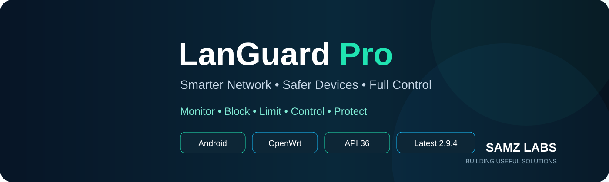

<p align="center">
  
</p>

<p align="center">
  <a href="https://play.google.com/store/apps/details?id=com.samz.languardpro"></a>
  <a href="https://github.com/SAMZLAB-PK/LanGuard-Pro-Releases/releases"></a>
  
  
</p>

<p align="center"><strong>LanGuard Pro</strong> is a mobile-first router companion for fast device visibility, traffic monitoring and practical home-network control — without turning router management into a wall of technical menus.</p>

<p align="center"><a href="https://play.google.com/store/apps/details?id=com.samz.languardpro"><strong>Get LanGuard Pro on Google Play</strong></a> &nbsp;•&nbsp; <a href="CHANGELOG.md">What's new</a> &nbsp;•&nbsp; <a href="SUPPORT.md">Support</a> &nbsp;•&nbsp; <a href="https://github.com/SAMZLAB-PK/LanGuard-Pro-Privacy">Privacy</a></p>

---

## Network control that stays readable

| ⚡ Live Traffic | 📱 Device Control | 🛡️ Security Controls |
| --- | --- | --- |
| Per-device upload/download activity with a responsive foreground refresh. | Identify, rename and manage connected devices from a phone-friendly interface. | Block or restore internet access quickly and keep policy state synchronized. |

| 🚦 Speed Limits | 🚫 AdBlock Control | 🌐 LuCI + Companion |
| --- | --- | --- |
| Apply practical per-device limits and priority controls. | Check router-side AdBlock state and start or stop it without digging through menus. | Android and native LuCI share the same router companion data path for consistent status. |

## Latest release — 2.9.4 (20905)

> **Release focus:** connection resilience, more accurate live traffic and cleaner Play Store readiness.

- Smarter SSH trust recovery with **Reset SSH Trust & Retry** guidance when router identity changes.
- Fixed the host-key repository path that could surface `NullPointerException` during SSH reconnects.
- Foreground Home and Devices refresh tuned to a **2-second cadence** for a more LuCI-like realtime feel.
- Dual-stack traffic accounting for **IPv4 + IPv6** device activity.
- Improved handling for devices that are active but previously showed no live speed.
- Speed-test fallback tuned to avoid unnecessary parallel load while preserving useful results.
- Android target aligned with **API 36**.
- LuCI includes direct Google Play and public release/support links.

See the complete history in **[CHANGELOG.md](CHANGELOG.md)**.

## How LanGuard Pro fits together

```text
Android app
    │
    ├── secure router session / SSH installer
    │
    └── canonical Companion / ubus data
                     │
              OpenWrt / ImmortalWrt
                     │
        ┌────────────┴────────────┐
        │                         │
    LuCI LanGuard Pro       Router services
        │                         │
        └──── shared state ───────┘
```

The public repository is intentionally a **release, support and documentation hub**. The active development source repository is private.

## Router compatibility

LanGuard Pro is built around **OpenWrt / ImmortalWrt** style routers with SSH, ubus and LuCI integration. Current development and validation have focused primarily on the Xiaomi/Redmi AX3200 / AX6S class and compatible router environments.

Router firmware layouts vary. Before major firmware upgrades, keep a router backup and be prepared to reinstall or repair the LanGuard companion package.

## Privacy and security

LanGuard Pro is designed for local router administration. Sensitive router credentials should not be posted in public issues, screenshots or logs.

- 🔐 **Privacy policy:** [LanGuard-Pro-Privacy](https://github.com/SAMZLAB-PK/LanGuard-Pro-Privacy)
- 🛡️ **Security reporting:** [SECURITY.md](SECURITY.md)
- 🧰 **Troubleshooting:** [SUPPORT.md](SUPPORT.md)

## Need help?

Before opening an issue, include useful technical context — but **never include passwords, SSH keys or Play signing material**.

➡️ **[Open a support issue](https://github.com/SAMZLAB-PK/LanGuard-Pro-Releases/issues/new/choose)**

---

<p align="center"><strong>SAMZ Labs</strong><br>Building practical network tools, dashboards and automation projects.<br><br><a href="https://github.com/SAMZLAB-PK">GitHub</a> &nbsp;•&nbsp; <a href="https://play.google.com/store/apps/details?id=com.samz.languardpro">Google Play</a> &nbsp;•&nbsp; <a href="https://github.com/SAMZLAB-PK/LanGuard-Pro-Privacy">Privacy</a></p>
